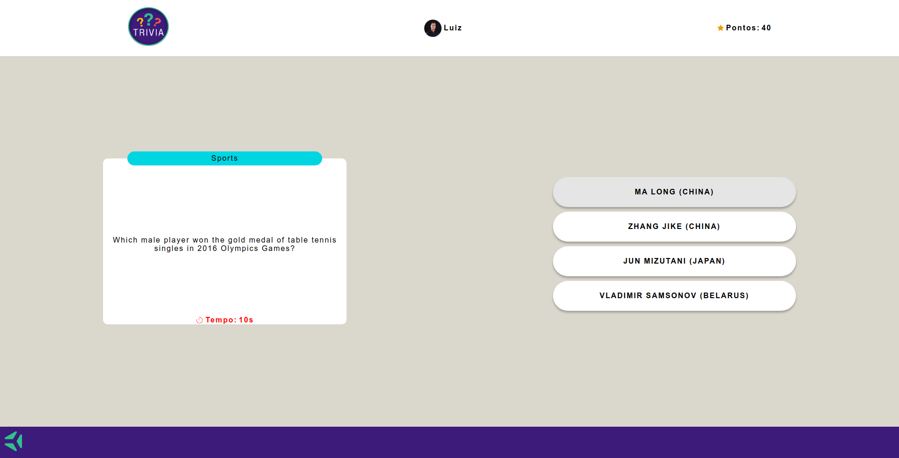

# Sejam bem-vindos ao projeto Trivia!! 🕹️🎮

#### Esse projeto tem como objetivo propor um jogo de perguntas e respostas no estilo Show do Milhão. 

  

## Tecnologias :

<ul>
  <li>HTML</li>
  <li>CSS</li>
  <li>Java Script</li>
  <li>React</li>
  <li>Redux</li>
  <li>Jest</li>
  <li>React Testing Library</li>
</ul>

## Funcionalidades:

- Possível logar com e-mail e nome (se seu e-mail tiver uma conta no site <a href="https://pt.gravatar.com/">Gravatar</a> ira aparecer sua foto no perfil).
- Possível jogar o jogo de 5 perguntas de multipla escolha tendo 30 segundos para respoder cada pergunta.
- Possível observar sua pontuação de acordo com o progresso do jogo e ao finalizar as 5 perguntas.
- Possível ver hanking de pontos das jogadas anterires.

## Como executar:

- Clone em seu computador (via SHH).
- Abra um novo terminal em seu VSCode.   
- Execute o comando para instalar dependências: `npm install`.
- Para incializar execute o comando: `npm start`.

## Também disponível em:

### <a href="https://trivia-delta-neon.vercel.app/" ><b>Trivia</b></a>

## Como contribuir no projeto:
  1. Faça um **fork** do projeto;
  2. Crie uma nova branch com as suas alterações: `git checkout -b my-feature`;
  3. Salve as alterações e crie uma mensagem de commit contando o que você fez: `git commit -m "feature: My new feature"`;
  4. Envie as suas alterações: `git push origin my-feature`;
  5. Abra o seu pull-request na página do GitHub.  

## Licença:

 Esse projeto está sob a licença: 

 

 ##  Autores:

### <a href="https://www.linkedin.com/in/jorge-reis-dev/" ><b>Jorge Wellington.</b></a>

### <a href="https://github.com/luizlacerdam" ><b>Luiz Lacerda.</b></a>

### <a href="https://github.com/brenoealmeida" ><b>Breno Almenida.</b></a>

### <a href="https://github.com/priscilarjsouza" ><b>Priscila Souza.</b></a>

### <a href="https://www.linkedin.com/in/sarah-santana-ferreira-4619801b3/" ><b>Sarah Ferreira.</b></a>
